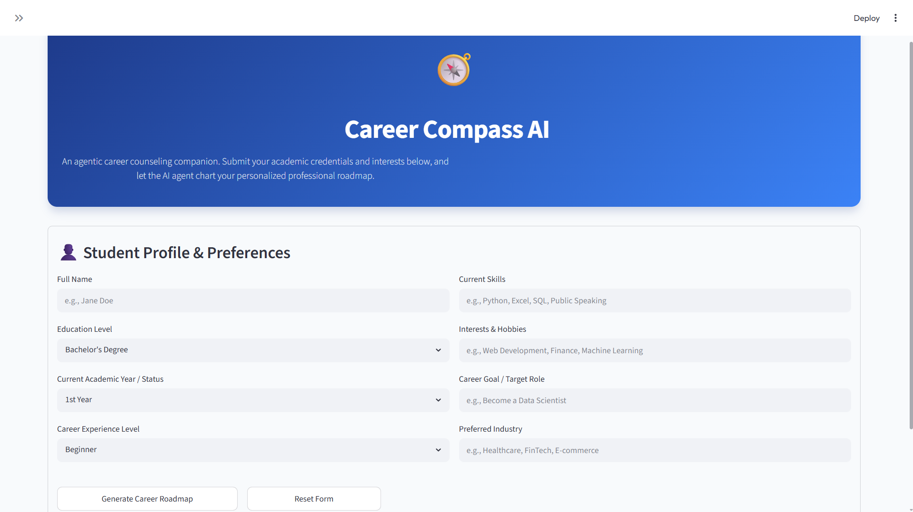
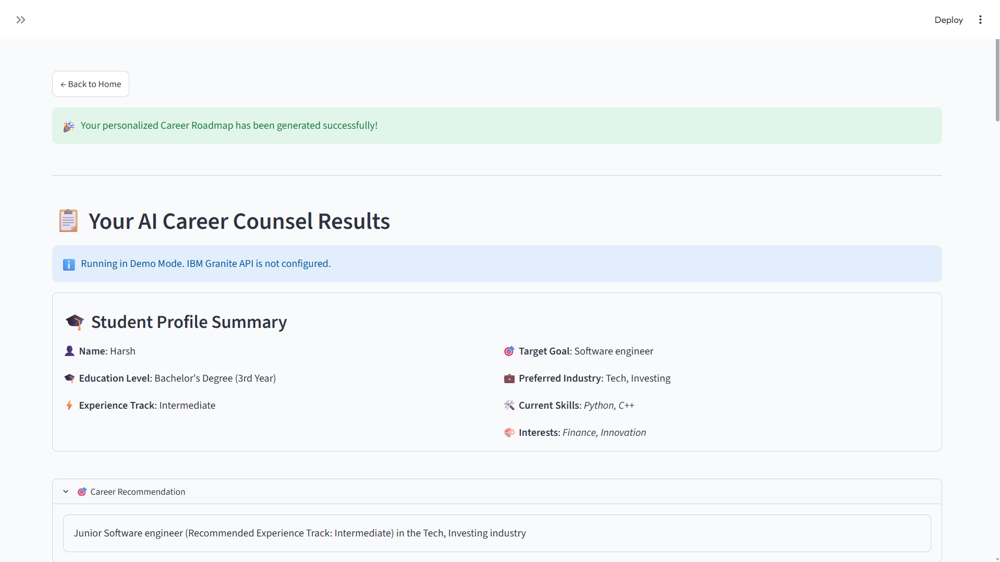
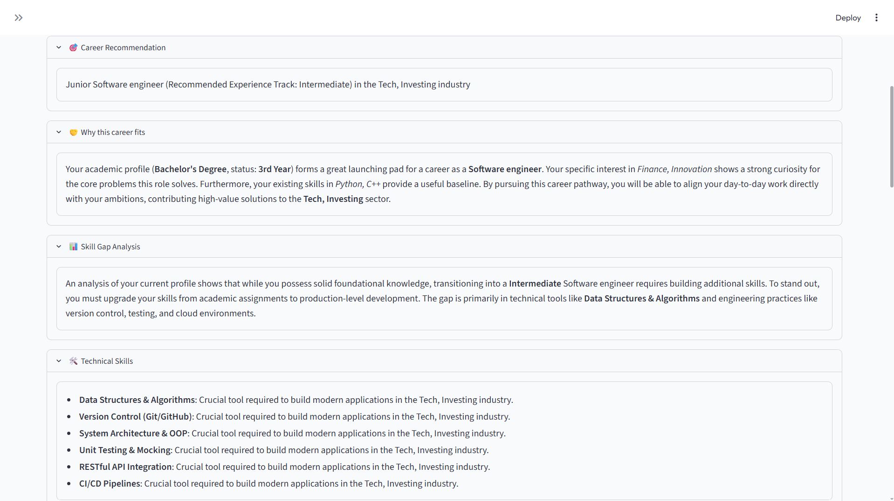
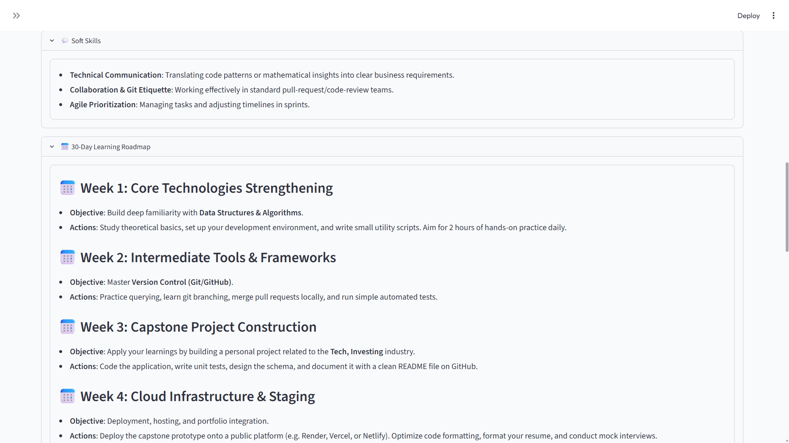

# Career-Compass-AI

Career Compass AI is an AI-powered career counseling application that helps students identify suitable career paths based on their education, skills, interests, and career goals.

The application generates personalized career recommendations, skill gap analysis, certifications, projects, interview preparation tips, and a structured 30-day learning roadmap.

## Features

- Personalized Career Recommendation
- Skill Gap Analysis
- Technical & Soft Skills Guidance
- 30-Day Learning Roadmap
- Recommended Certifications
- Project Suggestions
- Interview Preparation Tips
- Resume Improvement Tips
- Download Career Roadmap

  ## Tech Stack

- Python
- Streamlit
- IBM watsonx.ai (Architecture Ready)
- IBM Granite

## Project Structure

Career-Compass-AI/
|
├── app.py
├── requirements.txt
├── README.md
└── screenshots/

#Installation
git clone https://github.com/Harshgoyal-code/Career-Compass-AI.git

cd Career-Compass-AI

pip install -r requirements.txt

streamlit run app.py

## 📸 Project Screenshots

### 🏠 Home Page

---

### 🤖 AI Career Recommendation Dashboard

---

### 📊 Skill Gap Analysis

---

### 📅 30-Day Learning Roadmap

## Future Scope
Resume Analysis

LinkedIn Integration

IBM Granite Live API

Job Recommendation

Resume Score

## Author
Harsh Goyal
